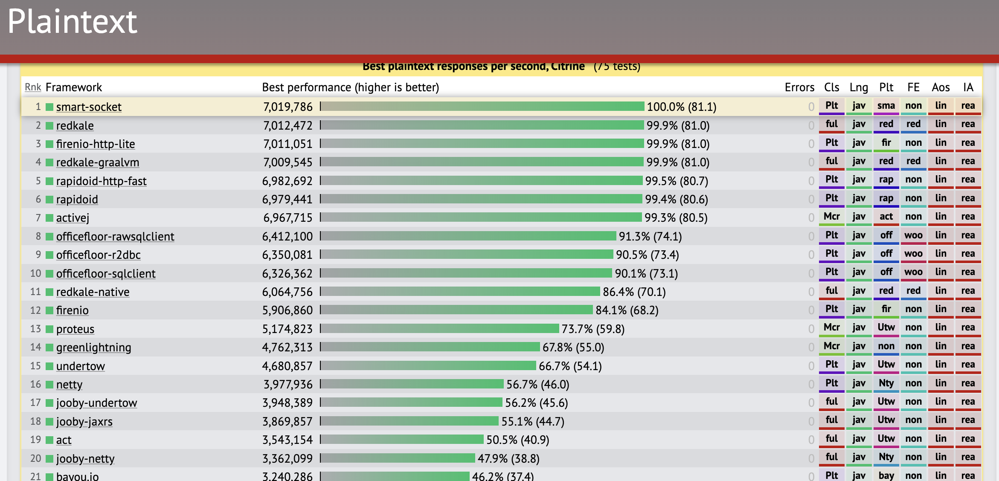

## smart-socket  

 

**smart-socket** is an open source communication framework 100% self-developed by [smart-boot](https://smartboot.gitee.io/), by strengthening the implementation of AIO so that it has  better communication performance and stability beyond other major languages.

With its simplicity, ease of use and high performance, smart-socket has been recognized and favored by many [developers and enterprises](https://smartboot.gitee.io/smart-socket/users.html).

**[Documentation](https://smartboot.gitee.io/smart-socket/)**

### 🍁 Features
1. High performance, high concurrency, low latency, energy saving.
2. Very little code, good readability. The core code is less than 1500 lines, and the project structure and package hierarchy are clear
3. Low learning threshold, secondary development only need to implement two interfaces (Protocol， MessageProcessor), almost no learning costs if you have experience in communications development .
4. Good threading model , memory model design , to ensure efficient and stable operation of the service .
5. Support for custom plugins , and has provided many plugins , including : SSL/TLS communication plugins , heartbeat plugins , disconnected reconnect plugins , service metrics plugins , blacklist plugins and memory pool monitoring plugins .

### 🍭Recommendation
- [smart-socket stand-alone million long connection tutorial](https://mp.weixin.qq.com/s/l_IBSBI6SAY4FmomwLFa-Q)
- [A must-read for newcomers: communication protocols](https://mp.weixin.qq.com/s/2w9C8CQvhOXZsLEOd6Gzww)
- [Scheduling model for communication frameworks with graphical representation](https://mp.weixin.qq.com/s/Hq4T-X7LtjIOVi1aEEvxKQ)
- [Communication Framework smart-socket Design Overview](https://mp.weixin.qq.com/s/M9sMfDKahgsR8LgX0M4CVQ)

### 🎃Performance Ranking

### 🎈List of plugins
| Plugin | Usage |
|---|---|
|BlackListPlugin|Blacklist plugin, smart-socket will refuse to establish a connection with the IP in the blacklist|
|BufferPageMonitorPlugin|Memory pool monitoring plugin|
|HeartPlugin|Heartbeat plugin|
|MonitorPlugin|Service Metrics Monitoring Plugin|
|SocketOptionPlugin|Connection property configuration plugin|
|SslPlugin|TLS/SSL encrypted communication plugin|
|StreamMonitorPlugin|Transport layer communication stream monitoring plugin|

### 🍩Acknowledgment
- Thanks to Gitee for code hosting and Pages service!。
- Thanks to JetBrains for providing the IDEA License for smart-socket.   
    

### 🥳Join the community

- **Official [QQ](https://im.qq.com/index/) Group：** 172299083 、830015805。Entry requirements：
  1. Average user：[donate ¥5](https://smartboot.tech/donation.html)，and note your QQ number, we will manually review the group members。
  2. Enterprises users：Complete [[Case Registration](https://gitee.com/smartboot/smart-socket/issues/IHV69)] and note the company name when adding the group。
- Scan the QR code at the bottom to follow the Sandao public account on WeChat。

​	
