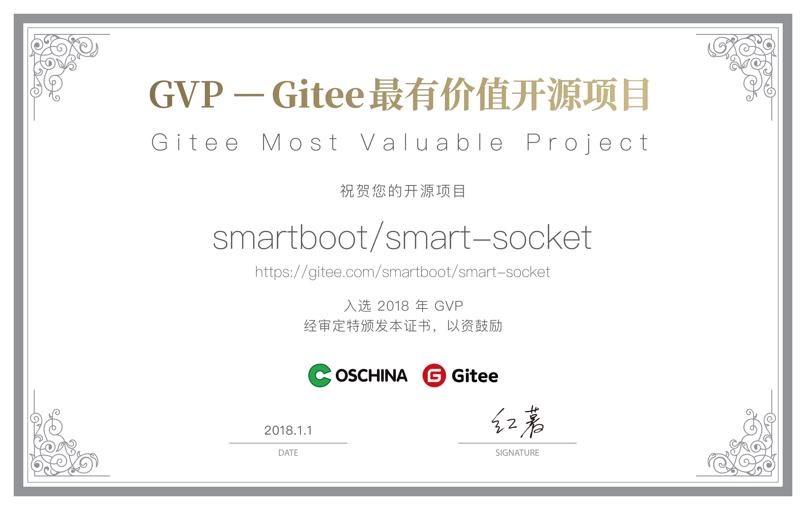

## smart-socket [](https://996.icu) 

smart-socket是一款国产开源的 Java AIO 通信框架，支持 TCP、UDP、SSL/TLS 。

作为一款极简、易用、高性能的通信框架，现已广泛运用于物联网、公安、证券、电力、电商等诸多领域。

**愿景**：
- 数据传输更快
- 并发能力更高
- 硬件能耗更低
---
**官方QQ群：** 172299083🈵 、**830015805**（非技术人员请勿扰，感谢）
**微信公众号：**smart_boot 或者扫描二维码

---
### Feature
1. 源码：代码量极少，可读性强。核心代码不到 1500 行，工程结构、包路径层次清晰。
2. 学习：学习门槛低，二次开发只需实现 2 个接口（Protocol、MessageProcessor）。具备通信开发经验的几乎无学习成本，根据作者经验来看大家普遍面临的困难在于"通信协议"的概念理解以及编解码实现，而非通信框架本身。
3. 使用：通过内存池（bufferPool）技术以及背压（back-pressure）机制，既能充分发挥机器性能，又能保证服务运行稳定性。
4. 服务：提供丰富的插件式服务，包括：SSL/TLS通信插件、心跳插件、断链重连插件、服务指标统计插件、黑名单插件、内存池监测插件。

### 交流互助
如果您在使用的过程中碰到问题，可以通过下面几个途径寻求帮助，同时我们也鼓励资深用户给新人提供帮助。

-  Email：zhengjunweimail@163.com。
- [开源问答](https://www.oschina.net/question/tag/smart-socket)
- 通过 [Issue](https://gitee.com/smartboot/smart-socket/issues) 报告 bug 或进行咨询。
- 提交 [Pull Request](https://gitee.com/smartboot/smart-socket/pulls) 改进 smart-socket 的代码。
- 在开源中国发表smart-socket相关的技术性文章。

### 开源生态
1. [smart-http](https://gitee.com/smartboot/smart-http) 国内首款基于smart-socket实现的Http服务器
2. [irtu-gps](https://gitee.com/wendal/irtu-gps) 基于iRTU项目,实现GPS数据的接收和展示
3. [企业案例](https://gitee.com/smartboot/smart-socket/issues/IHV69)
> 如果您的项目中使用了 smart-socket 并愿意在此处展现给大众，欢迎留言反馈。


### 感谢
- 感谢码云提供的代码托管和 Pages 服务。
- 感谢 JetBrains 为 smart-socket 提供的 IDEA License。
- 感谢为 smart-socket [捐赠](https://smartboot.gitee.io/book/donation.html)的每一位朋友。
- 感谢正在使用及为 smart-socket 作推广的朋友。

## 性能测试
- 环境准备
    1. 测试项目：[smart-http](https://gitee.com/smartboot/smart-http) 
    2. 通信协议：Http
    3. 压测工具：[wrk](https://github.com/wg/wrk)
    4. 测试机：MacBook Pro, 2.9Ghz i5, 4核8G内存
    5. 测试命令：
    ```
    wrk -H 'Host: 10.0.0.1' -H 'Accept: text/plain,text/html;q=0.9,application/xhtml+xml;q=0.9,application/xml;q=0.8,*/*;q=0.7' -H 'Connection: keep-alive' --latency -d 15 -c 1024 --timeout 8 -t 4 http://127.0.0.1:8080/plaintext -s pipeline.lua -- 16
    ```
- 测试结果：smart-socket的性能表现基本稳定维持在 128MB/s 左右。

    |  连接数  | Requests/sec   |  Transfer/sec  |
    | -- | -- | -- |
    | 512 | 924343.47 | 128.70MB|
    | 1024 | 922967.92 | 128.51MB|
    | 2048 | 933479.41 | 129.97MB|
    | 4096 | 922589.53 | 128.46MB|

### 参考文献
- https://jfarcand.wordpress.com/2008/11/25/tricks-and-tips-with-aio-part-1-the-frightening-thread-pool/
- https://webtide.com/on-jdk-7-asynchronous-io/
- https://www.cnblogs.com/sandea/p/9094863.html

### 关于作者
Edit By 三刀  
E-mail:zhengjunweimail@163.com  
Update Date: 2019-11-07
