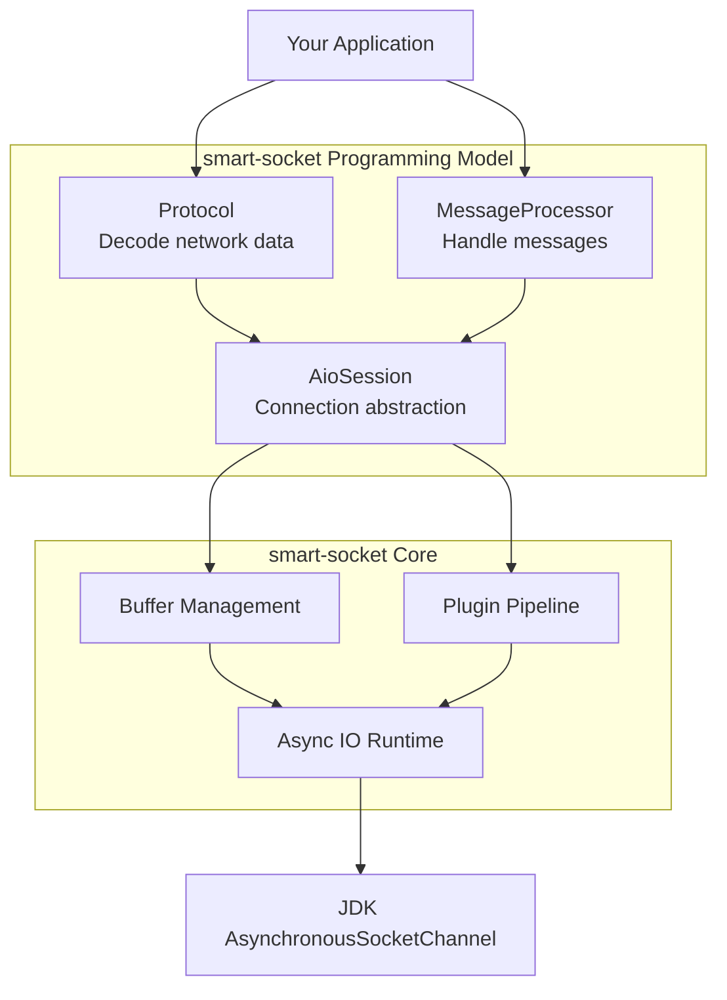

# smart-socket

<p align="center">

<b>A lightweight Java AIO communication framework for building high-performance TCP applications.</b>

</p>


<p align="center">

[](LICENSE)
[](https://central.sonatype.com/artifact/io.github.smartboot.socket/aio-core)
[](https://github.com/smartboot/smart-socket)

</p>


---

## Introduction

smart-socket is a lightweight Java AIO communication framework built on top of the JDK asynchronous I/O model.

It provides a simple programming model for developing TCP communication applications with:

- Protocol-based message processing
- Session-oriented connection management
- Efficient memory management
- Extensible plugin architecture


smart-socket is designed for scenarios that require:

- Long-lived TCP connections
- Custom communication protocols
- High-concurrency network applications
- Lightweight Java infrastructure components


---

## Features


### 🚀 Java AIO Based

Built on the native JDK asynchronous I/O API.

smart-socket simplifies Java AIO development by providing higher-level abstractions:

- AioQuickServer
- AioQuickClient
- AioSession


---

### 🪶 Lightweight Architecture

smart-socket focuses on simplicity and low dependency overhead.

Benefits:

- Easy to understand
- Easy to integrate
- Easy to customize


---

### 🔌 Protocol Driven Design

smart-socket separates network communication from message processing.

Two core interfaces define application logic:


```

Protocol<T>

MessageProcessor<T>

```


`Protocol` is responsible for decoding network data into application messages.

`MessageProcessor` handles decoded messages and executes business logic.


---

### 💾 Efficient Memory Management

smart-socket provides an optimized buffer management model for network communication.

It helps reduce unnecessary memory allocation and improves stability for long-running connections.


---

### 🧩 Extensible Plugin System

Plugins can extend communication behavior without modifying the core framework.

Built-in capabilities include:

- SSL/TLS support
- Socket configuration
- Runtime monitoring
- Traffic monitoring
- Buffer monitoring


---

# Architecture



```mermaid
flowchart TB

    APP[Your Application]

    subgraph API[smart-socket Programming Model]

        PROTOCOL[Protocol<T><br/>Decode network data]

        PROCESSOR[MessageProcessor<T><br/>Handle messages]

        SESSION[AioSession<br/>Connection abstraction]

    end


    subgraph CORE[smart-socket Core]

        BUFFER[Buffer Management]

        PIPELINE[Plugin Pipeline]

        IO[Async IO Runtime]

    end


    JDK[JDK AsynchronousSocketChannel]


    APP --> PROTOCOL
    APP --> PROCESSOR

    PROTOCOL --> SESSION
    PROCESSOR --> SESSION

    SESSION --> BUFFER
    SESSION --> PIPELINE

    BUFFER --> IO
    PIPELINE --> IO

    IO --> JDK
```


The framework separates:

- Network communication
- Protocol decoding
- Business processing


---

# Quick Start


## Maven Dependency


```xml
<dependency>
    <groupId>io.github.smartboot.socket</groupId>
    <artifactId>aio-pro</artifactId>
    <version>${latest.version}</version>
</dependency>
````

---

## Create a TCP Server

```java
public class EchoServer {

    public static void main(String[] args) {

        AioQuickServer<String> server =
                new AioQuickServer<>(
                        8888,
                        new StringProtocol(),
                        new StringProcessor()
                );

        server.start();
    }
}
```

Your asynchronous TCP server is ready.

---

# Client Support

smart-socket also provides client-side communication support through:

```
AioQuickClient
```

The same protocol and message processing model can be used for both client and server communication.


---

# Ecosystem

smart-socket is part of the smartboot open-source ecosystem. It provides the networking foundation for a range of lightweight, high-performance projects.

## Feat

A lightweight Java application framework for building modern backend services.

Features:

* Lightweight runtime with minimal overhead
* Simple and productive programming model
* High-performance web service development

Repository:

[https://github.com/smartboot/feat](https://github.com/smartboot/feat)

---

## smart-mqtt

A lightweight MQTT broker for connecting and managing IoT devices.

Features:

* Efficient support for high-concurrency device connections
* MQTT-focused message routing and processing
* Lightweight deployment for resource-constrained environments

Repository:

[https://github.com/smartboot/smart-mqtt](https://github.com/smartboot/smart-mqtt)

---

## Redisun

A lightweight Redis client component built on top of smart-socket for efficient Redis communication.

Features:

* Redis protocol support
* Efficient connection management
* Simple integration with Java applications

Repository:

[https://github.com/smartboot/redisun](https://github.com/smartboot/redisun)

---

# Documentation

Documentation:

[https://smartboot.tech/smart-socket](https://smartboot.tech/smart-socket)

Examples:

[https://github.com/smartboot/smart-socket/tree/master/smart-socket-example](https://github.com/smartboot/smart-socket/tree/master/smart-socket-example)

---

# Roadmap

* [x] Java AIO communication core
* [x] TCP client and server support
* [x] Protocol-based communication model
* [x] Plugin architecture
* [x] SSL/TLS support
* [x] Monitoring support
* [ ] More examples
* [ ] More ecosystem integrations
* [ ] More international documentation

---

# Contributing

Contributions are welcome!

You can help by:

* Reporting issues
* Improving documentation
* Creating examples
* Submitting pull requests

---

# License

smart-socket is licensed under the Apache License 2.0.
