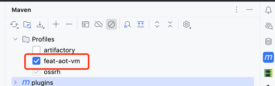

import CheckAuthorize from '../../../components/CheckAuthorize.astro'
import Mermaid from '../../../components/Mermaid.astro'
import { TabItem, Tabs, Aside } from "@astrojs/starlight/components";

<CheckAuthorize/>

你是否想过，为什么有些应用启动速度飞快，而有些却需要漫长的等待？

在现代应用开发中，性能优化是一个永恒的话题。今天，让我们一起来探索 Feat 框架中的 AOT（Ahead-of-Time）编译技术，看看它是如何帮助我们构建高性能应用的。

Feat框架通过AOT（Ahead-of-Time）编译技术实现零反射的运行时环境，在编译期完成所有代码生成和优化工作。这意味着什么呢？简单来说，就是把原本在应用运行时才需要做的工作提前到编译阶段完成，从而大大提升了应用的启动速度和运行效率。

### 核心原理

AOT编译的核心是`FeatAnnotationProcessor`，基于Java APT技术在编译期扫描和处理注解：

<Mermaid code={`
sequenceDiagram
    participant Compiler as Java编译器
    participant Processor as FeatAnnotationProcessor
    participant Generator as 代码生成器
    participant File as 目标文件
    
    Compiler->>Processor: 调用process方法
    Processor->>Processor: 扫描@Controller、@Bean等注解
    
    loop 处理每个注解元素
        Processor->>Generator: 创建对应Serializer
        Generator->>File: 生成Java代码
    end
    
    Processor->>File: 生成SPI配置文件
`} />

实际的注解处理器支持以下注解：

```java
@Override
public Set<String> getSupportedAnnotationTypes() {
    Set<String> types = new HashSet<>();
    types.add(Bean.class.getCanonicalName());        // Bean管理
    types.add(Autowired.class.getCanonicalName());   // 依赖注入
    types.add(Controller.class.getCanonicalName());  // Web控制器
    types.add(Mapper.class.getCanonicalName());      // 数据访问层
    types.add(McpEndpoint.class.getCanonicalName()); // MCP协议端点
    return types;
}
```

是不是感觉很神奇？在传统的开发模式中，框架需要在运行时通过反射来分析类结构、处理注解，这不仅消耗时间，还占用内存。而 Feat 的 AOT 技术将这些工作提前到编译期完成，让我们的应用在启动时就能直接运行优化后的代码。

### 代码生成体系

Feat采用模板方法模式设计了序列化器体系：

<Mermaid code={`
classDiagram
    class Serializer {
        +serializeLoadBean()
        +serializeAutowired()
        +serializeRouter()
        +order() int
    }
    
    class ControllerSerializer {
        +serializeRouter()
        +order() 100
    }
    
    class BeanSerializer {
        +serializeLoadBean()
        +serializeAutowired()
        +order() 200
    }
    
    class MapperSerializer {
        +serializeLoadBean()
        +order() 300
    }
    
    Serializer <|-- ControllerSerializer
    Serializer <|-- BeanSerializer
    Serializer <|-- MapperSerializer
`} />

优化策略包括：
1. **死代码消除**：分析依赖关系，只生成实际使用的代码
2. **内联优化**：将简单的方法调用直接内联到生成代码中
3. **类型特化**：针对具体类型生成优化的序列化代码

在实际开发中，这些优化策略帮助我们构建出更加高效的代码。比如，当你写一个简单的控制器时：

```java
@Controller("demo2")
public class Demo2Controller {
    
    @RequestMapping("/param1")
    public String test2(@Param("param") String param) {
        return "hello " + param;
    }
}
```

AOT 编译器会将其转换为优化后的代码，完全避免了运行时反射的开销。

### 代码转换示例

通过真实示例展示AOT编译的代码转换过程：

<Tabs>
    <TabItem label="源代码">
        ```java title="Demo2Controller.java"
        @Controller("demo2")
        public class Demo2Controller {
            
            @RequestMapping("/param1")
            public String test2(@Param("param") String param) {
                return "hello " + param;
            }
            
            @RequestMapping("/param3")
            public String test4(TestParam param) {
                return "hello " + param.getParam1() + " " + param.getParam2();
            }
        }
        ```
    </TabItem>
    
    <TabItem label="生成代码">
        ```java title="Demo2ControllerCloudService.java"
        /**
         * Copyright (c) 2022-2025 smartboot.tech All Rights Reserved.
         * @Author: 三刀 zhengjunweimail@163.com
         */
        public class Demo2ControllerCloudService extends AbstractCloudService {
            private Demo2Controller bean;
            
            public void loadBean(ApplicationContext applicationContext) throws Throwable {
                bean = new Demo2Controller(); // 直接实例化，无反射
            }
            
            public void router(ApplicationContext applicationContext, Router router) {
                // 生成路由映射代码
                router.route("/demo2/param1", ctx -> {
                    JSONObject jsonObject = getParams(ctx.Request);
                    String param0 = jsonObject.getObject("param", String.class);
                    String rst = bean.test2(param0);
                    byte[] bytes = rst.getBytes("UTF-8");
                    ctx.Response.setContentLength(bytes.length);
                    ctx.Response.write(bytes);
                });
                
                router.route("/demo2/param3", ctx -> {
                    JSONObject jsonObject = getParams(ctx.Request);
                    TestParam param0 = jsonObject.to(TestParam.class);
                    String rst = bean.test4(param0);
                    byte[] bytes = rst.getBytes("UTF-8");
                    ctx.Response.setContentLength(bytes.length);
                    ctx.Response.write(bytes);
                });
            }
        }
        ```
    </TabItem>
</Tabs>

关键优化点：
1. **零反射Bean实例化**：直接生成`new Demo2Controller()`调用
2. **零反射依赖注入**：直接生成Bean获取和设置代码
3. **预编译路由**：编译期生成完整的路由处理逻辑
4. **类型安全**：编译期确定参数类型，避免运行时类型转换
5. **性能优化**：生成专用的序列化和反序列化代码

通过上面的示例，我们可以看到 AOT 编译的强大之处。原本需要在运行时通过反射创建对象、解析注解的操作，现在都被直接编译成了高效的 Java 代码。

### SPI服务发现

生成的服务类通过Java SPI机制进行加载：

<Mermaid code={`
graph LR
    A[编译期] --> B[生成CloudService实现]
    B --> C[创建SPI配置文件]
    C --> D[META-INF/services/CloudService]
    
    E[运行期] --> F[ServiceLoader.load]
    F --> G[加载所有CloudService]
    G --> H[按order排序]
    H --> I[依次执行生命周期]
`} />

### 核心优势

| 特性 | 传统框架 | AOT模式 |
|------|---------|----------|
| **编译期优化** | 运行时反射解析 | 编译期静态生成代码 |
| **启动性能** | 需要类扫描和注解解析 | 直接加载预生成代码 |
| **内存效率** | 运行时元数据缓存 | 编译期优化，减少运行时开销 |
| **GraalVM支持** | 需要复杂配置 | 原生兼容 |

:::tip
AOT 模式让我们的应用在启动时就达到最佳性能状态，尤其适合对启动时间有严格要求的场景，如云原生应用、微服务等。
:::

## AOT虚拟机

**AOT VM模式**专为开发阶段设计，通过运行时反射模拟AOT编译行为，提供与AOT模式一致的API体验。

| 特性 | AOT模式 | AOT VM模式 |
|------|---------|------------|
| **编译期优化** | ✅ 静态生成 | ❌ 运行时处理 |
| **启动性能** | 🚀 毫秒级 | ⚡ 快速 |
| **开发体验** | 🔧 需重编译 | 🔄 热重载 |
| **适用场景** | 🏭 生产环境 | 🧪 开发测试 |

两种模式都遵循相同的Bean生命周期管理规范：

<Mermaid code={`
stateDiagram-v2
    [*] --> 创建实例: loadBean()
    创建实例 --> 属性注入: autowired()
    属性注入 --> 初始化: postConstruct()
    初始化 --> 路由注册: router()
    路由注册 --> 运行中: 服务就绪
    运行中 --> 销毁: destroy()
    销毁 --> [*]: 应用关闭
    
    note right of 创建实例
        AOT: 静态new实例
        VM: 反射创建实例
    end note
    
    note right of 属性注入
        AOT: 直接setter调用
        VM: 反射字段注入
    end note
    
    note right of 路由注册
        AOT: 预生成路由代码
        VM: 反射解析@RequestMapping
    end note
`} />

### 启用AOT VM模式

要启用AOT VM模式，需要对Maven项目进行以下配置：

1. 添加profiles配置：

    ```xml
    <profiles>
        <profile>
            <id>feat-aot-vm</id>
            <properties>
                <!-- 必须为true,以便 AOT VM 运行时识别方法参数名 -->
                <maven.compiler.parameters>true</maven.compiler.parameters>
            </properties>
            <dependencies>
                <dependency>
                    <groupId>tech.smartboot.feat</groupId>
                    <artifactId>feat-cloud-starter</artifactId>
                    <version>${feat.version}</version>
                    <exclusions>
                        <!-- 禁用 AOT 组件 -->
                        <exclusion>
                            <groupId>tech.smartboot.feat</groupId>
                            <artifactId>feat-cloud-aot</artifactId>
                        </exclusion>
                    </exclusions>
                </dependency>
                <!-- 启用 AOT VM 组件 -->
                <dependency>
                    <groupId>tech.smartboot.feat</groupId>
                    <artifactId>feat-cloud-aot-vm</artifactId>
                    <version>${feat.version}</version>
                </dependency>
            </dependencies>
        </profile>
    </profiles>
    ```

2. 在IDEA中勾选相应的profile以激活AOT VM模式
    

<Aside type="tip">
    **实战建议**：开发时使用AOT VM模式提高调试效率，部署时切换到AOT模式获得最佳性能。两种模式的API完全兼容，切换成本极低。
</Aside>