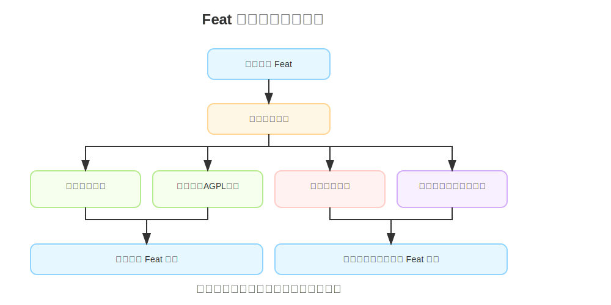

import architecture from './img/architecture.svg';

Feat 是一个高性能、低资源消耗的 Java Web 服务开发框架，类似 Vert.x 和 Spring Boot。

核心特性：
- 高性能异步通信，轻松应对高并发
- 支持 HTTP/1.0、HTTP/1.1、HTTP/2、WebSocket、SSE
- 内置静态资源服务器，支持 HTTPS
- 灵活插件与配置，适合企业级复杂应用

## Feat 的开源故事

Feat 诞生于 2024年12月21日，这是一个承载着六年开源经验的全新项目。它的前身是广受好评的开源框架 smart-http，在社区中积累了丰富的实践经验和技术沉淀。

在 smart-http 达到相对稳定和成熟的阶段后，我们做出了一个战略性的决定：将项目交由社区维护，同时启动全新的 Feat 项目。这个决定让我们能够在保持 smart-http 稳定服务现有用户的同时，探索更多创新的可能性。

选择创建 Feat 的核心原因，是希望在保持高性能的基础上，能够更自由地实践一些前瞻性的技术理念。这些想法在原有的框架中可能难以实现，但在 Feat 中将得到充分的施展空间。

Feat 继承了 smart-http 的优秀基因，同时也带来了全新的技术视角和更多可能性。我们相信，Feat 不仅能够满足现代企业级应用的需求，还将在性能优化、资源利用等方面带来更多突破性的创新。

## 为什么需要 Feat？

我们希望基于 Feat 开发的 Web 服务可以：

- **高效性能**：在运行速度上更高效一些，改变大家对于 Java 服务性能差的观念
- **资源节省**：在资源开销上更节省一些，改变大家对于 Java 服务内存高的观念
- **开发友好**：在开发体验上更友好一些，改变大家对于 Java 服务设计臃肿的观念

## 如何正确使用 Feat

Feat 采用了 AGPL 协议，在遵循该开源协议的前提下，你可以自由地使用 Feat 开发 Web 服务。

倘若你的应用场景无法遵循开源规约，需联系我们获得 [Feat 的商业授权](/feat/auth/) 方可使用。

以下流程图展示了 Feat 框架的不同授权使用方式：

