import { Card, CardGrid,LinkCard,LinkButton } from '@astrojs/starlight/components';
import FeatUsers from '../../components/FeatUsers.astro'
import {ContributorList} from "starlight-contributor-list";

<FeatUsers/>

## 产品特色

<CardGrid>
	<Card title="<span style='color:#ffffff;background-color:#fa541c;border-bottom: 2px solid #fa541c'> &nbsp;F&nbsp;</span><span style='color:#fa541c;border-bottom: 2px solid #fa541c'>ree</span>" icon="seti:happenings">
        基于AGPL-3.0开源协议，保障技术透明与社区共建。合规授权企业可自由商用，共建开放生态。
	</Card>
	<Card title="<span style='color:#ffffff;background-color:#722ed1;border-bottom: 2px solid #722ed1'>&nbsp;E&nbsp;</span><span style='color:#722ed1;border-bottom: 2px solid #722ed1'>lastic</span>" icon="rocket">
        柔性伸缩架构，轻松应对海量并发请求，支持十万级、百万级 QPS，满足高并发场景需求。
	</Card>
	<Card title="<span style='color:#ffffff;background-color:#52c41a;border-bottom: 2px solid #52c41a'>&nbsp;A&nbsp;</span><span style='color:#52c41a;border-bottom: 2px solid #52c41a'>dvanced</span>" icon="puzzle">
        全面支持 HTTP/1.0、1.1、2.0、WebSocket、SSE、TLS/SSL 等现代 Web 技术，内置路由、文件上传、WAF 等丰富功能。
	</Card>
	<Card title="<span style='color:#ffffff;background-color:#eb2f96;border-bottom: 2px solid #eb2f96'>&nbsp;T&nbsp;</span><span style='color:#eb2f96;border-bottom: 2px solid #eb2f96'>iny</span>" icon="github">
        微内核架构，基于自研smart-socket通信引擎。冷启动耗时低于 100ms，极致性能与资源效率的完美平衡。
	</Card>
</CardGrid>

```java title="Application.java"
@Controller
public class Application {
    @RequestMapping("/")
    public String helloWorld() {
        return "hello Feat Cloud";
    }

    public static void main(String[] args) {
        Feat.cloudServer().listen();
    }
}
```

<center>
    <h2>Feat boasts unparalleled performance</h2>
    
</center>

## Contributors
<ContributorList githubRepo="smartboot/feat"/>

## 生态项目
<CardGrid>
    <LinkCard title="smart-socket" target="_blank" description="Java AIO 实现的支持百万级长连接通信框架" href="https://smartboot.tech/smart-socket/" />
    <LinkCard title="smart-servlet" target="_blank" description="提供一个自主可控的轻量级 Tomcat/Undertow 可替代版本，基于 Feat 重新定义下一代 Servlet 容器!" href="https://smartboot.tech/smart-servlet/" />
    <LinkCard title="smart-mqtt" target="_blank" description="一款面向物联网领域的 MQTT 消息中间件产品" href="https://smartboot.tech/smart-mqtt/enterprise.html" />
    <LinkCard title="Redisun" target="_blank" description="基于 smart-socket 开发的轻量级 Redis 客户端，专为 Java 平台设计，支持异步非阻塞 I/O 操作" href="https://smartboot.tech/redisun/" />
</CardGrid>

<hr/>

<center>
###  联系我们

    <p>
        Hi~ 我是 **三刀**，Feat 的作者。

        您可以跟我聊聊：如何进行 Feat 的最佳实践;

        也可以向我了解：关于产品实现原理的细节;

        也可以跟我讨论：双方如何合作......

        期待您通过下面方式，与我取得联系。
    </p>

    <h4>微信</h4>
    

    <h4>邮件</h4>
    <LinkButton
        href="mailto:zhengjunweimail@163.com"
        variant="secondary"
        icon="email"
        iconPlacement="start"
    >
        zhengjunweimail @163.com
    </LinkButton>
</center>